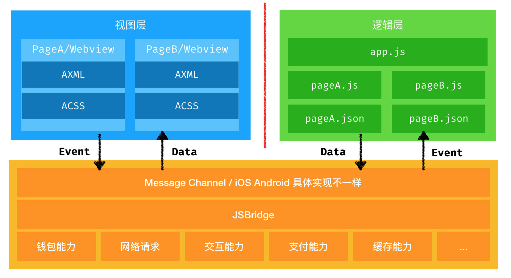

小程序的架构
1. 客户端开发复杂，多套代码，版本迭代发布审核麻烦，发布周期长。
2. web安全问题，性能问题（单线程js，逻辑性能问题导致交互阻塞），能力问题
3. 使用hybird混合方案
webview：web技术实现载体 -> web渲染引擎
逻辑层：worker，单独的js上下文，一个脚本解析执行器
类似于react renderer

将js运行环境从浏览器中剥离，业务需要的「能力」通过jsapi提供给业务
能力：浏览器提供的能力 window.alert window.confirm等

使用离线包发布，性能好，版本可控，可回滚，可监管审核。

nebula容器
容器能做什么？
* 渲染引擎
    * ios wkwebview
    * Android UC内核
    * 自研引擎
* 提供jsapi
    * 硬件能力
    * native能力
* 应用离线包管理

JSAPI
小程序的逻辑层没有任何浏览器相关的特性。
* ios native端通过jsContext的定制能力，将方法暴露给js
* Android 通过serviceWorker实现
    * 同步和异步的api
        * 同步jsapi使用importScript实现，可以同步加载远端js文件，调用一个jsapi，动态加载对应的js，所以这里会有网络阻塞的问题，尽量用异步的
        * 异步jsapi，借用native能力，向worker内注入方法

同层渲染能力
绘制输入框、地图、播放视频等富交互场景，web渲染容易有渲染问题，容器可以在webview中嵌入native webview提升性能。nativeVIew覆盖在webView之上，无法通过z-index覆盖，实际上是一个Object节点

WKCompositingView iOS有动画的节点会被独立出来作为一个单独的合成层

appx1.0

每一小程序页面都是单独的weiview上下文，和逻辑层是一对多的关系


appx框架设计的时候都努力向serviceworker标准看齐，容器在ios上用jsContext实现了serviceWorker的能力，安卓上直接使用UC提供的serviceWorker实现

axml会被编译成js代码，节点都被编译成了对应的React.createElement



编译是使用webpack做的
框架内有使用constant-element做优化，维护在ref中，不需要有逻辑的节点直接复用ref，不再调用React.createElement方法创建，省去部分初始化的过程

页面axml => pageComponent
* pure component
* 发送页面生命周期事件，发送交互事件
* 接收worker发送过来的setData事件，触发自己的setState

Js
都送进了worker层，没什么特别的


appx2.0
svelte的理念，编译时收集依赖，对使用到的字段 生成对应的if else代码，直接操作dom，实现去react。
为什么react不能做到静态编译？

今晚得做完的事情
不能让首长再来“教”你怎么跳槽了吧

ppt怎么写好
