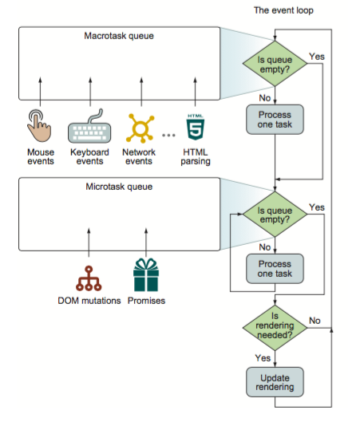

# 我的薄弱点

## html/css
* 文档流
* bfc

## js基础
### 调用栈、闭包、作用域、作用域链
* 闭包的形成
* 作用域的形成
  * 活动对象
  * 变量对象
* 调用栈的形成
* 垃圾回收机制
* module
  * cmd for nodejs
    * exports
    * module.exports
  * amd
    * define
    * 运行时加载
  * umd（前面一个函数）
    * cmd + amd
  * es module
    * 编译时加载，遇到import时生成模块引用，到运行时根据引用去被加载的模块里取值
  

### 原型链
```js
class A {}
const a = new A();

a.__proto__ === A.prototype
A.prototype.__proto__ === Object.prototype
Object.prototype.__proto__ === null

```

### ES6
* decorator
* iterator
* proxy

### promise
* promise + generator = async await
* [事件循环](https://www.youtube.com/watch?v=8aGhZQkoFbQ)
* [事件循环标准](https://html.spec.whatwg.org/multipage/webappapis.html#event-loops)
  * 单线程的js，调用栈不为空时是阻塞渲染的
  * web api 操作完成的时机将回调放入task queue
  * loop
    * marcotask 浏览器BOM方法产生的回调
    * microtask promise回调，中间产生的microTask也会被放进同一个队列
    * update rendering 会在这个时候执行raf的回调（重新渲染前）


## mvvm框架原理

### React、Redux、Router、Saga
* `state`更新的过程是怎么样的？为什么`setState`是异步的
* antd的`getFileDecorator`是怎么实现双向绑定的
* `connect`做了什么
* `immutable`解决了什么问题
* `Saga`发布订阅机制是怎么实现的
* [最佳实践](https://github.com/sorrycc/blog/issues/1)umi
* [React新的理念](https://segmentfault.com/a/1190000020110166)
  
### vue
* `v-model`是怎么实现的双向绑定的
* 指令系统是怎么实现的
* `template`里依赖是怎么收集起来的
* `computed`是怎么做到的
* [学习](https://www.bilibili.com/video/BV1d4411v7UX)

## 工程
cli
脚手架
devServer
webpack

### 想要解决什么问题？
* 技术栈脱离浏览器限制
  * less、sass、postcss、css in js、scoped css
    * plugin
  * es latest
    * babel
  * es module
  * dynamic import
* 打包与性能优化
  * bundle
    * uglify
    * tree shaking
  * lib
    * dll
    * alias
* 研发流程
  * lint
  * test
  * scripts
    * dev
    * test
    * build
    * publish / deploy
* 基础建设
  * cli
  * 内部资产、组件、包管理平台、工具平台

## 计算机网络基础
* TCP/IP
* HTTP
  * HTTPS
  * HTTP2.0
  * HTTP 3.0
* 浏览器的网络进程是什么，都干了啥

## 浏览器基础、v8原理
* 浏览器进程
* 渲染引擎与单线程JS
  * 页面渲染流程
    * html string -> 解析生成DOM + 网络资源
    * CSS -> CSSOM
    * DOM Node + CSSOM Node -> Layout Tree Node
    * Layout Tree -> Composite Layer
    * Composite Layer -> Bit Map
    * paint
  * event-loop
    * call stack
    * call stack push task -> task run -> call stack pop task
    * task call web api （click、ajax、setTimeout、Promise） -> finish -> job（promise）/task queue push job/task
    * call stack empty -> check job/task queue -> call stack push job/task -> job/task run

## 数据结构算法
* 栈
* 链表
* 哈希表
* 树
  * 二叉树
  * 平衡二叉树
  * 二叉查找树
  * 红黑树
  * B树
  * B+树
* 图

### 排序
* 快排
### 动态规划
* 缓存 + 递归（递推）

### 贪心算法
* 难以求得最优解
* 选择一个子问题（局部）的最优解以此推出总问题的最优解

### ？？其他经典算法 对算法 不懂的地方太多了

## 杂谈自己

我总想找找自己到底欠缺了什么，总说想要学习什么，前端的知识点，关注浏览器api，关注node能做的事情，查漏补缺就好了。

不要给自己设限了，真正的web开发不能只是前端的开发。

2020年07月08日18:44:59
最近对自己未掌握的知识点感到很焦虑。学习效率其实很低。想探索一下自己究竟在焦虑什么。
* 是怕不能胜任工作？
* 是学不进去？
* 是没有形成知识图谱？