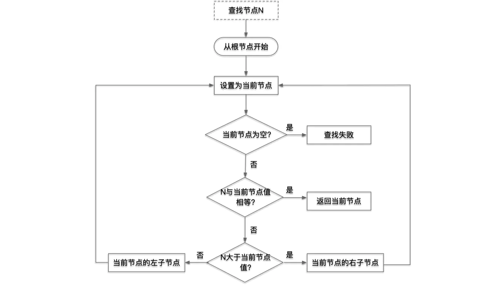

# 红黑树
* 对称二叉 B 树
* 由红黑节点组成并能自平衡的二叉查找树

## 二叉查找树
* 若任意节点的左子树不为空，则左子树上所有节点的值均小于它的根节点的值
* 若任意节点的右子树不为空，则右子树上所有节点的值均大于它的根节点的值
* 任意节点的左、右子树也分别为二叉查找树
* 没有键值相等的节点

### 查找过程

## 树的遍历
* 先根遍历
  * DLR
* 中根遍历
  * LDR
* 后根遍历
  * LRD

## 红黑树
> 二叉查找树不是平衡树，无法保证查找时间O(log n)，极端情况下会退化成链表
* 每个节点或者是黑色或者是红色
* 根节点是黑色
* 每个叶子节点（null）是黑色
* 如果一个节点是红色，则它的子节点必须是黑色，即**两个红色节点不能直接相连**
* 从一个节点到该节点的子孙节点的所有路径上包含相同数目的黑色节点

以上特性可以避免二叉查找树退化成单链表的情况，4、5保证了任意节点到其每个叶子节点路径中最长路径不会超过最短路径的 2 倍，红黑树是相对**黑色节点的平衡二叉树**。

插入和删除可能会破坏红黑树的性质并打破平衡，需要通过旋转、变色调整从而让树继续保持平衡。

### 旋转

### 变色

